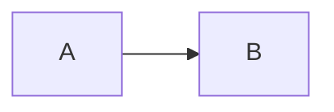

# KDRG (Kcct-D Report Generator)

KDRG (`kdrg`) は、神戸高専電子工学科の実験報告書を Markdown から PDF に生成する CLI ツールです。

表紙情報は `report.json` に保存し、本文は `index.md` に書きます。`kdrg export` を実行すると、表紙つきの PDF が `output/` に出力されます。

## 主な機能

- 指定形式に近い表紙の自動生成
- Markdown 本文から PDF を生成
- 見出し番号の自動付与
- 図表番号と本文中参照の自動解決
- `plot` コードブロックによる簡易グラフ生成
- Mermaid 図のレンダリング
- KaTeX による TeX 数式レンダリング
- 本文ページ番号を表紙の次から開始

## インストール

このリポジトリを手元で使う場合:

```sh
npm install
npm run build
npm link
```

GitHub から直接インストールする場合:

```sh
npm install -g github:canta-9142/kcctd-reportgen
```

Playwright の Chromium が未導入の場合は、以下も実行してください。

```sh
npx playwright install chromium
```

## 使い方

最初に、プロジェクトルートで個人情報を設定します。

```sh
kdrg config
```

これにより `kdrg.config.json` が作成または更新されます。

```json
{
  "grade": "1",
  "studentNumber": "12",
  "name": "山田太郎"
}
```

次に、レポートを作成します。

```sh
kdrg init
```

対話形式でレポート情報を入力すると、以下のファイルが生成されます。

```text
reports/<年>_<テーマ番号>/report.json
reports/<年>_<テーマ番号>/index.md
```

本文は `index.md` に書きます。

PDF を出力するには、レポートフォルダ名を指定して `export` を実行します。

```sh
kdrg export 2026_T1A1
```

この場合、`reports/2026_T1A1/index.md` が変換されます。

絶対パスも指定できます。

```sh
kdrg export C:\path\to\reports\2026_T1A1
```

## ファイル構成

標準的な構成は以下です。

```text
project-root/
  kdrg.config.json
  reports/
    2026_T1A1/
      report.json
      index.md
      output/
        2026_T1A1_山田太郎.pdf
```

レポートフォルダ名は次の形式です。

```text
<年>_<テーマ番号>
```

出力される PDF ファイル名は次の形式です。

```text
<年>_<テーマ番号>_<名前>.pdf
```

PDF は、`index.md` があるフォルダから見て `./output/` の中に出力されます。

中間 HTML はデフォルトでは削除されます。

## `export` のオプション

```sh
kdrg export 2026_T1A1 --keep-html
```

`--keep-html` を指定すると、`output/` に以下の中間ファイルを残します。

```text
cover.html
body.html
compiled.md
```

```sh
kdrg export 2026_T1A1 --no-index-sync
```

デフォルトでは、`export` 時に `report.json` の内容を `index.md` 先頭の自動生成メタデータブロックへ同期します。

`--no-index-sync` を指定すると、この同期を行いません。

`report.json` の `submittedOn` が空欄の場合、`export` 実行日で自動入力されます。`resubmittedOn` はプログラム側では常に空欄として扱います。

## `report.json`

`report.json` には、表紙に出力する情報を保存します。

```json
{
  "year": 2026,
  "themeId": "T1A1",
  "title": "I-V特性の測定",
  "teacher": "高専先生",
  "startedOn": "2026-05-20",
  "endedOn": "2026-05-20",
  "submittedOn": "",
  "resubmittedOn": "",
  "grade": "1",
  "studentNumber": "12",
  "group": "3",
  "name": "山田太郎",
  "partners": ["佐藤花子"],
  "comments": ""
}
```

`grade`、`studentNumber`、`name` は `kdrg config` の内容を初期値として使います。

## Markdown 本文

本文は `index.md` に書きます。見出し番号は自動生成されるため、手入力しません。

```md
# 目的

# 原理

# 実験機器

# 実験方法

# 実験結果

# 考察

# 参考文献
```

出力時には、次のように番号が付与されます。

```text
1. 目的
2. 原理
3. 実験機器
...
```

`参考文献` には章番号を付けません。

## 図表キャプションと参照

図表キャプションは HTML コメントで宣言します。

```md
<!-- graph: a1: I-V特性 -->
<!-- table: parts: 使用器具一覧 -->
```

PDF では次のように出力されます。

```text
図1 I-V特性
表1 使用器具一覧
```

本文中では `${変数名}` で参照できます。

```md
${a1}に測定結果を示す。
```

出力時には次のようになります。

```text
図1に測定結果を示す。
```

未定義の参照はエラーにせず、警告を出して元の文字列を残します。

## Plot ブロック

グラフは `plot` コードブロックで記述できます。

メタ情報と CSV データは `---` で区切ります。

````md
```plot
caption: I-V特性
var: a1
x:
  label: 電圧
  unit: V
  log: false
y:
  label: 電流
  unit: A
  log: false
---
x,y
0,0
1,0.02
2,0.04
```
````

`caption` と `var` が両方ある場合、その plot は図として登録され、下部に図番号つきキャプションが追加されます。

`caption`、`var`、`x`、`y` は省略できます。

軸設定では以下を指定できます。

```yaml
label: 電圧
unit: V
log: false
```

CSV データは必ず次のヘッダーから始めます。

```csv
x,y
```

MVP では、`x` と `y` の 2 系列のみ対応しています。

## Mermaid

Mermaid は通常のコードフェンスで記述できます。

````md

````


## TeX 数式

インライン数式:

```md
抵抗値は $R = \frac{V}{I}$ で求められる。
```

独立数式:

```md
$$
f_0 = \frac{1}{2\pi\sqrt{LC}}
$$
```

数式レンダリングには KaTeX を使用します。

## 開発

KDRG は TypeScript で実装しています。ソースは `src/` にあり、ビルド結果は `dist/` に出力されます。

```sh
npm run build
npm test
```

実行ファイル [bin/kdrg.js](bin/kdrg.js) は、ビルド済みの `dist/src/cli.js` を読み込みます。

GitHub から直接 npm install された場合は、npm の `prepare` スクリプトにより TypeScript がビルドされます。

## ライセンス

MIT
